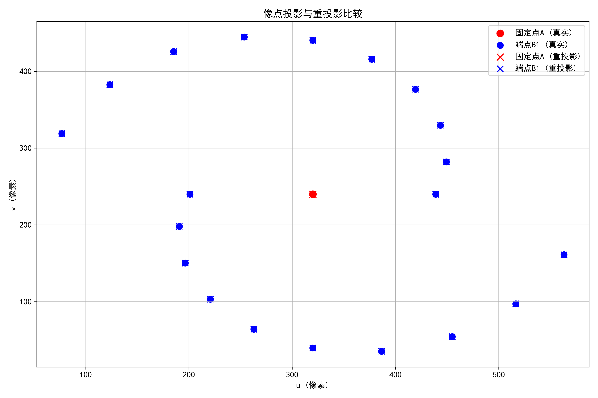
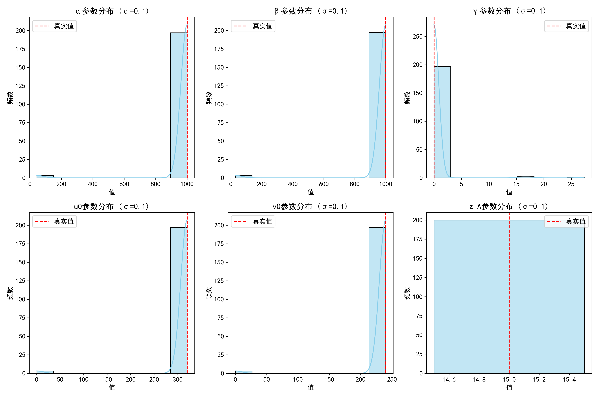

# math04
## 第一问
### 参数设置
1. 相机内参数
   - alpha = 1000  # u轴比例因子
   - beta = 1000  # v轴比例因子
   - gamma = 5  # 倾斜参数
   - u0, v0 = 320, 240  # 主点坐标

2. 相机外参数（世界坐标系与相机坐标系重合）
   - R = [[1, 0, 0],  
    [0, 1, 0],  
    [0, 0, 1]]  # 旋转矩阵（单位矩阵）
   - t = [0, 0, 0]  # 平移向量（零向量）

3. 一维物体参数
   - A = np.array([0, 0, 10])  # 固定点坐标 (x,y,z)
   - L = 5  # 线段长度

4. 灵敏性分析参数
   - num_segments = 6  # 线段数量
   - num_perturbations = 1000  # 每个点的扰动次数
   - angle_std = 0.01  # 角度扰动标准差（弧度）

### 计算结果
1. 固定点A的像点坐标: [320. 240.]  

2. 各线段端点B的像点坐标:
   - 线段 1: (511.21, 312.92)
   - 线段 2: (621.75, -99.11)
   - 线段 3: (25.70, 23.81)
   - 线段 4: (238.97, -54.98)
   - 线段 5: (423.81, 253.49)
   - 线段 6: (422.64, 220.34)

3. 灵敏性分析统计量:  
线段    平均距离(像素)       标准差            最大距离(像素)       
1     3.3267         1.8598         10.9790        
2     4.7224         2.6118         17.9952        
3     4.2581         2.2842         12.3854        
4     4.1098         2.1067         11.3029        
5     2.9202         1.9673         13.0819        
6     2.9082         1.8925         11.2621        

4. 整体统计:
   - 全局平均距离: 3.7076 像素
   - 全局标准差: 2.2467 像素
   - 全局最大距离: 17.9952 像素
### 图片
1. 
2. 
## 第二问
### 计算结果
固定点A像点坐标: [320. 240.]
端点B像点范围: u=[76.8, 563.2], v=[35.4, 444.6]

真实内参矩阵:
[[1000.    0.  320.]
 [   0. 1000.  240.]
 [   0.    0.    1.]]

估计内参矩阵:
[[1000.    0.  320.]
 [   0. 1000.  240.]
 [   0.    0.    1.]]

真实深度 z_A = 10.0000, 估计深度 z_A = 10.0000

重投影误差验证:
固定点A误差: 0.000000 像素
端点B平均误差: 0.000000 像素
中间点C平均误差: 0.000000 像素

扰动分析 (σ=0.5像素, 成功次数=200/200):
参数   均值             偏差             标准差            RMSE           
α    1000.0197      0.0197         0.7386         0.7389         
β    999.9957       -0.0043        0.7167         0.7167         
γ    0.0000         0.0000         0.0000         0.0000         
u0   320.0019       0.0019         0.0752         0.0752         
v0   240.0004       0.0004         0.0717         0.0717         
z_A  10.0000        0.0000         0.0000         0.0000         

=== 正在进行噪声水平 σ=0.10 的分析 ===

扰动分析 (σ=0.1像素, 成功次数=100/100):
参数   均值             偏差             标准差            RMSE           
α    999.9963       -0.0037        0.1390         0.1391         
β    999.9842       -0.0158        0.1263         0.1272         
γ    0.0000         0.0000         0.0000         0.0000         
u0   320.0024       0.0024         0.0143         0.0145         
v0   239.9999       -0.0001        0.0172         0.0172         
z_A  10.0000        0.0000         0.0000         0.0000         

=== 正在进行噪声水平 σ=0.50 的分析 ===

扰动分析 (σ=0.5像素, 成功次数=100/100):
参数   均值             偏差             标准差            RMSE           
α    1000.1027      0.1027         0.7441         0.7511         
β    999.8937       -0.1063        0.6457         0.6544         
γ    0.0000         0.0000         0.0000         0.0000         
u0   319.9913       -0.0087        0.0801         0.0805         
v0   240.0005       0.0005         0.0776         0.0776         
z_A  10.0000        0.0000         0.0000         0.0000         

=== 正在进行噪声水平 σ=1.00 的分析 ===

扰动分析 (σ=1.0像素, 成功次数=100/100):
参数   均值             偏差             标准差            RMSE           
α    999.8571       -0.1429        1.4812         1.4881         
β    1000.0447      0.0447         1.4035         1.4042         
γ    0.0000         0.0000         0.0000         0.0000         
u0   319.9989       -0.0011        0.1471         0.1471         
v0   240.0035       0.0035         0.1652         0.1652         
z_A  10.0000        0.0000         0.0000         0.0000
       
### 图片
1. 
2. 
3. 
4. 
5. 

## 第三问
=== 生成正常配置（中点配置）===
固定点A像点坐标: [21.33333333 16.        ]
端点B像点范围: u=[-199.6, 262.7], v=[-243.1, 187.1]

=== 中点配置下的标定 ===

真实内参矩阵:
[[1000.    0.  320.]
 [   0. 1000.  240.]
 [   0.    0.    1.]]

中点配置下的估计内参矩阵:
[[3.09285255e+02 1.73767680e+00 5.32542168e-02]
 [0.00000000e+00 3.11990332e+02 4.97241654e-02]
 [0.00000000e+00 0.00000000e+00 1.00000000e+00]]

真实深度 z_A = 15.0000, 估计深度 z_A = 15.0000

=== 中点配置下的重投影误差 ===

重投影误差验证:
固定点A误差: 26.661837 像素
端点B平均误差: 144.052472 像素
中间点C平均误差: 79.756511 像素

=== 中点配置下的扰动分析 ===

扰动分析 (σ=0.5像素, 成功次数=1000/1000):
参数   均值             偏差             标准差            RMSE           
α    914.2853       -85.7147       257.2779       271.1806       
β    899.4966       -100.5034      256.9496       275.9059       
γ    -0.6054        -0.6054        139.3062       139.3075       
u0   275.5323       -44.4677       110.6724       119.2717       
v0   206.6455       -33.3545       83.0134        89.4637        
z_A  15.0000        0.0000         0.0000         0.0000         

=== 生成接近奇异的配置（改进版本）===
奇异配置 - 固定点A像点坐标: [21.33333333 16.        ]
奇异配置 - 端点B像点:
  B1: (40.9, 12.0)
  B2: (28.5, 29.3)
  B3: (3.6, 29.3)
  B4: (-8.9, 12.0)
  B5: (3.6, -5.3)
  B6: (28.5, -5.3)

=== 检查奇异性条件 ===
B点椭圆拟合误差: 0.0001
C点椭圆拟合误差: 0.0001
配置是否接近奇异: True

=== 奇异配置下的标定 ===

真实内参矩阵:
[[1000.    0.  320.]
 [   0. 1000.  240.]
 [   0.    0.    1.]]

奇异配置下的估计内参矩阵:
[[1000.    0.  320.]
 [   0. 1000.  240.]
 [   0.    0.    1.]]

真实深度 z_A = 15.0000, 估计深度 z_A = 15.0000

=== 奇异配置下的重投影误差 ===

重投影误差验证:
固定点A误差: 0.000000 像素
端点B平均误差: 0.000000 像素
中间点C平均误差: 0.000000 像素

=== 奇异配置下的扰动分析 ===

扰动分析 (σ=0.5像素, 成功次数=1000/1000):
参数   均值             偏差             标准差            RMSE           
α    962.9471       -37.0529       181.7353       185.4741       
β    961.3982       -38.6018       189.1236       193.0228       
γ    1.1774         1.1774         9.2460         9.3206         
u0   307.2896       -12.7104       62.2691        63.5531        
v0   230.4349       -9.5651        46.8594        47.8257        
z_A  15.0000        0.0000         0.0000         0.0000         

=== 中点配置与奇异配置的对比 ===
参数   中点配置标准差             奇异配置标准差             变化率(%)         
α    257.2779            181.7353            -29.4          
β    256.9496            189.1236            -26.4          
γ    139.3062            9.2460              -93.4          
u0   110.6724            62.2691             -43.7          
v0   83.0134             46.8594             -43.6          
z_A  0.0000              0.0000              nan            

=== 中点配置与奇异配置的敏感性对比 ===

=== 正在进行噪声水平 σ=0.10 的分析 ===
中点配置:

扰动分析 (σ=0.1像素, 成功次数=200/200):
参数   均值             偏差             标准差            RMSE           
α    471.8378       -528.1622      271.6837       593.9422       
β    441.1031       -558.8969      257.4195       615.3296       
γ    28.2223        28.2223        260.2876       261.8132       
u0   33.6520        -286.3480      98.0793        302.6793       
v0   25.2581        -214.7419      73.5529        226.9893       
z_A  15.0000        0.0000         0.0000         0.0000         
奇异配置:

扰动分析 (σ=0.1像素, 成功次数=200/200):
参数   均值             偏差             标准差            RMSE           
α    985.7423       -14.2577       115.5384       116.4148       
β    985.5195       -14.4805       117.3436       118.2337       
γ    0.3041         0.3041         2.5417         2.5598         
u0   315.2122       -4.7878        38.7976        39.0919        
v0   236.4065       -3.5935        29.1202        29.3411        
z_A  15.0000        0.0000         0.0000         0.0000         

=== 正在进行噪声水平 σ=0.50 的分析 ===
中点配置:

扰动分析 (σ=0.5像素, 成功次数=200/200):
参数   均值             偏差             标准差            RMSE           
α    911.1474       -88.8526       380.8692       391.0961       
β    870.9786       -129.0214      276.4545       305.0796       
γ    -33.8310       -33.8310       421.9658       423.3198       
u0   260.8126       -59.1874       124.2287       137.6079       
v0   195.6114       -44.3886       93.1676        103.2015       
z_A  15.0000        0.0000         0.0000         0.0000         
奇异配置:

扰动分析 (σ=0.5像素, 成功次数=200/200):
参数   均值             偏差             标准差            RMSE           
α    971.7522       -28.2478       160.6316       163.0965       
β    970.9563       -29.0437       165.1606       167.6949       
γ    0.6245         0.6245         5.2319         5.2690         
u0   310.4561       -9.5439        54.2692        55.1021        
v0   232.8191       -7.1809        40.8326        41.4592        
z_A  15.0000        0.0000         0.0000         0.0000         

=== 正在进行噪声水平 σ=1.00 的分析 ===
中点配置:

扰动分析 (σ=1.0像素, 成功次数=200/200):
参数   均值             偏差             标准差            RMSE           
α    906.4229       -93.5771       258.3905       274.8132       
β    895.3089       -104.6911      280.8647       299.7419       
γ    -2.9509        -2.9509        34.7455        34.8706        
u0   280.0266       -39.9734       105.7598       113.0619       
v0   210.0060       -29.9940       79.3568        84.8360        
z_A  15.0000        0.0000         0.0000         0.0000         
奇异配置:

扰动分析 (σ=1.0像素, 成功次数=200/200):
参数   均值             偏差             标准差            RMSE           
α    967.3853       -32.6147       171.3163       174.3932       
β    966.2232       -33.7768       177.3621       180.5496       
γ    1.0082         1.0082         7.5602         7.6271         
u0   308.8707       -11.1293       58.4387        59.4890        
v0   231.6338       -8.3662        43.9297        44.7192        
z_A  15.0000        0.0000         0.0000         0.0000          

### 图片
1. 
2. 
3. 
4. 
5. 
6. 
