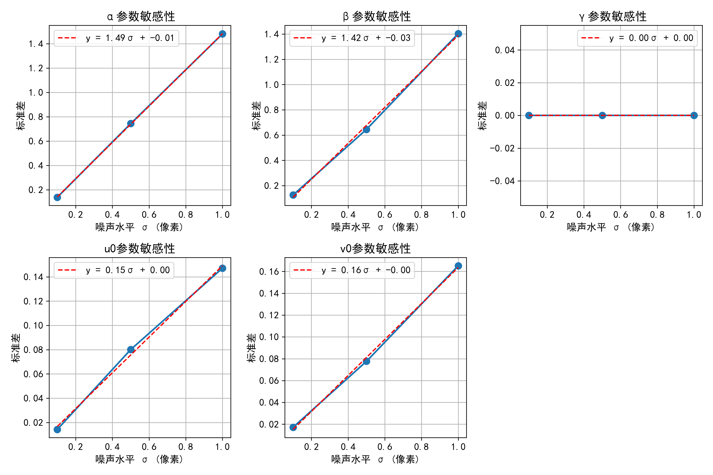
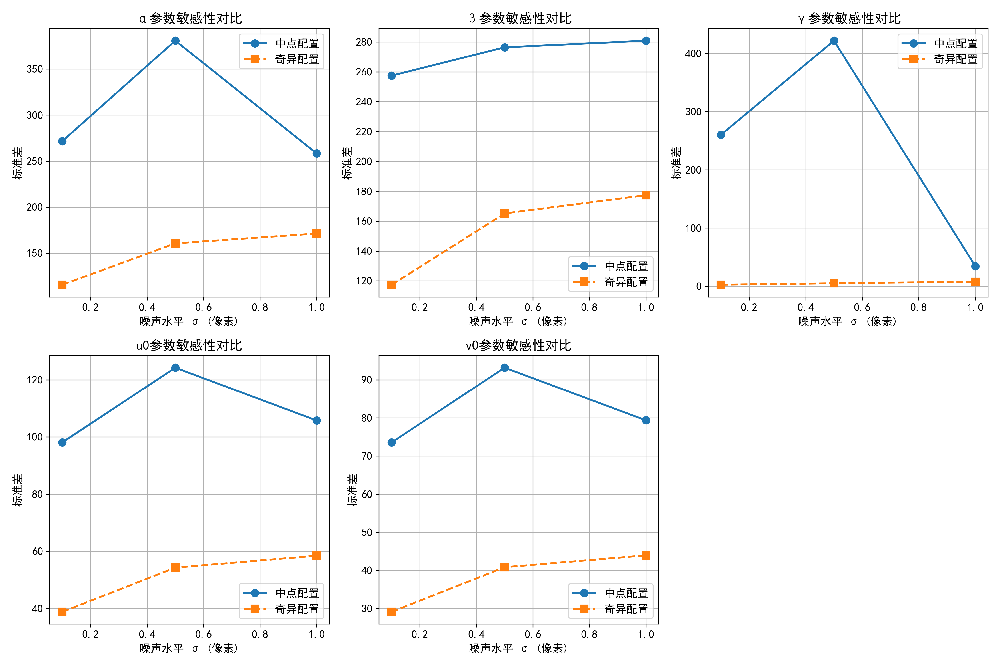

# math04
## 第一问
### 参数设置
1. 相机内参数
   - alpha = 1000  # u轴比例因子
   - beta = 1000  # v轴比例因子
   - gamma = 5  # 倾斜参数
   - u0, v0 = 320, 240  # 主点坐标

2. 相机外参数（世界坐标系与相机坐标系重合）
   - R = [[1, 0, 0],  
    [0, 1, 0],  
    [0, 0, 1]]  # 旋转矩阵（单位矩阵）
   - t = [0, 0, 0]  # 平移向量（零向量）

3. 一维物体参数
   - A = np.array([0, 0, 10])  # 固定点坐标 (x,y,z)
   - L = 5  # 线段长度

4. 灵敏性分析参数
   - num_segments = 6  # 线段数量
   - num_perturbations = 1000  # 每个点的扰动次数
   - angle_std = 0.01  # 角度扰动标准差（弧度）

### 计算结果
1. 固定点A的像点坐标: [320. 240.]  

2. 各线段端点B的像点坐标:
   - 线段 1: (511.21, 312.92)
   - 线段 2: (621.75, -99.11)
   - 线段 3: (25.70, 23.81)
   - 线段 4: (238.97, -54.98)
   - 线段 5: (423.81, 253.49)
   - 线段 6: (422.64, 220.34)

3. 灵敏性分析统计量:  
线段    平均距离(像素)       标准差            最大距离(像素)       
1     3.3267         1.8598         10.9790        
2     4.7224         2.6118         17.9952        
3     4.2581         2.2842         12.3854        
4     4.1098         2.1067         11.3029        
5     2.9202         1.9673         13.0819        
6     2.9082         1.8925         11.2621        

4. 整体统计:
   - 全局平均距离: 3.7076 像素
   - 全局标准差: 2.2467 像素
   - 全局最大距离: 17.9952 像素
### 图片
1. 
2. 
## 第二问
### 计算结果
固定点A像点坐标: [21.33333333 16.        ]
端点B像点范围: u=[-199.6, 262.7], v=[-243.1, 187.1]

真实内参矩阵:
[[1000.    0.  320.]
 [   0. 1000.  240.]
 [   0.    0.    1.]]

估计内参矩阵:
[[3.09420395e+02 1.79448653e+00 5.32519101e-02]
 [0.00000000e+00 3.12123246e+02 4.97587251e-02]
 [0.00000000e+00 0.00000000e+00 1.00000000e+00]]

真实深度 z_A = 15.0000, 估计深度 z_A = 15.0000

重投影误差验证:
固定点A误差: 26.661836 像素
端点B平均误差: 144.025112 像素
中间点C平均误差: 79.741889 像素

扰动分析 (σ=0.5像素, 成功次数=1000/1000):
参数   均值             偏差             标准差            RMSE           
α    914.8891       -85.1109       262.6296       276.0764       
β    899.5240       -100.4760      256.9175       275.8659       
γ    -0.2525        -0.2525        146.0036       146.0038       
u0   275.5321       -44.4679       110.6728       119.2722       
v0   206.6455       -33.3545       83.0134        89.4636        
z_A  15.0000        0.0000         0.0000         0.0000         

=== 正在进行噪声水平 σ=0.10 的分析 ===

扰动分析 (σ=0.1像素, 成功次数=200/200):
参数   均值             偏差             标准差            RMSE           
α    451.3916       -548.6084      235.3848       596.9733       
β    444.6840       -555.3160      252.5395       610.0427       
γ    48.2983        48.2983        205.9866       211.5731       
u0   32.0662        -287.9338      95.9780        303.5089       
v0   24.0617        -215.9383      71.9794        227.6190       
z_A  15.0000        0.0000         0.0000         0.0000         

=== 正在进行噪声水平 σ=0.50 的分析 ===

扰动分析 (σ=0.5像素, 成功次数=200/200):
参数   均值             偏差             标准差            RMSE           
α    921.8452       -78.1548       230.8653       243.7354       
β    912.6913       -87.3087       241.3517       256.6582       
γ    -0.7739        -0.7739        82.6540        82.6576        
u0   281.6139       -38.3861       103.9501       110.8111       
v0   211.2054       -28.7946       77.9760        83.1227        
z_A  15.0000        0.0000         0.0000         0.0000         

=== 正在进行噪声水平 σ=1.00 的分析 ===

扰动分析 (σ=1.0像素, 成功次数=200/200):
参数   均值             偏差             标准差            RMSE           
α    850.2264       -149.7736      316.5667       350.2094       
β    841.2948       -158.7052      330.9863       367.0685       
γ    0.5448         0.5448         85.8090        85.8107        
u0   259.2200       -60.7800       125.4951       139.4389       
v0   194.3990       -45.6010       94.1543        104.6159       
z_A  15.0000        0.0000         0.0000         0.0000         
### 图片
1. 
2. 
3. 
4. 
5. 

## 第三问
固定点A像点坐标: [21.33333333 16.        ]
端点B像点范围: u=[-199.6, 262.7], v=[-243.1, 187.1]

真实内参矩阵:
[[1000.    0.  320.]
 [   0. 1000.  240.]
 [   0.    0.    1.]]

估计内参矩阵:
[[3.09420395e+02 1.79448653e+00 5.32519101e-02]
 [0.00000000e+00 3.12123246e+02 4.97587251e-02]
 [0.00000000e+00 0.00000000e+00 1.00000000e+00]]

真实深度 z_A = 15.0000, 估计深度 z_A = 15.0000

重投影误差验证:
固定点A误差: 26.661836 像素
端点B平均误差: 144.025112 像素
中间点C平均误差: 79.741889 像素

=== 中点配置下的扰动分析 ===

扰动分析 (σ=0.5像素, 成功次数=1000/1000):
参数   均值             偏差             标准差            RMSE           
α    914.8891       -85.1109       262.6296       276.0764       
β    899.5240       -100.4760      256.9175       275.8659       
γ    -0.2525        -0.2525        146.0036       146.0038       
u0   275.5321       -44.4679       110.6728       119.2722       
v0   206.6455       -33.3545       83.0134        89.4636        
z_A  15.0000        0.0000         0.0000         0.0000         

=== 生成接近奇异的配置 ===
奇异配置 - 固定点A像点坐标: [21.33333333 16.        ]
奇异配置 - 端点B像点:
  B1: (53.2, 12.0)
  B2: (34.7, 33.6)
  B3: (-2.6, 33.6)
  B4: (-21.1, 12.0)
  B5: (-2.6, -9.5)
  B6: (34.7, -9.5)

=== 奇异配置下的标定 ===

真实内参矩阵:
[[1000.    0.  320.]
 [   0. 1000.  240.]
 [   0.    0.    1.]]

奇异配置下的估计内参矩阵:
[[1000.    0.  320.]
 [   0. 1000.  240.]
 [   0.    0.    1.]]

真实深度 z_A = 15.0000, 估计深度 z_A = 15.0000

=== 奇异配置下的重投影误差 ===

重投影误差验证:
固定点A误差: 0.000000 像素
端点B平均误差: 0.000000 像素
中间点C平均误差: 0.000000 像素

=== 奇异配置下的扰动分析 ===

扰动分析 (σ=0.5像素, 成功次数=1000/1000):
参数   均值             偏差             标准差            RMSE           
α    977.6622       -22.3378       142.6310       144.3696       
β    976.7328       -23.2672       148.3793       150.1925       
γ    0.6829         0.6829         7.9634         7.9926         
u0   312.3687       -7.6313        48.6674        49.2621        
v0   234.2555       -5.7445        36.6327        37.0804        
z_A  15.0000        0.0000         0.0000         0.0000         

=== 中点配置与奇异配置的对比 ===
参数   中点配置标准差             奇异配置标准差             变化率(%)         
α    262.6296            142.6310            -45.7          
β    256.9175            148.3793            -42.2          
γ    146.0036            7.9634              -94.5          
u0   110.6728            48.6674             -56.0          
v0   83.0134             36.6327             -55.9          
z_A  0.0000              0.0000              nan            

=== 中点配置与奇异配置的敏感性对比 ===

=== 正在进行噪声水平 σ=0.10 的分析 ===
中点配置:

扰动分析 (σ=0.1像素, 成功次数=200/200):
参数   均值             偏差             标准差            RMSE           
α    472.6841       -527.3159      273.6770       594.1053       
β    441.5189       -558.4811      258.3524       615.3430       
γ    28.0094        28.0094        266.2693       267.7384       
u0   33.6519        -286.3481      98.0794        302.6794       
v0   25.2582        -214.7418      73.5529        226.9892       
z_A  15.0000        0.0000         0.0000         0.0000         
奇异配置:

扰动分析 (σ=0.1像素, 成功次数=200/200):
参数   均值             偏差             标准差            RMSE           
α    986.2950       -13.7050       111.1127       111.9547       
β    985.4289       -14.5711       118.0767       118.9724       
γ    0.7667         0.7667         7.2118         7.2525         
u0   315.2572       -4.7428        38.4342        38.7257        
v0   236.4142       -3.5858        29.0573        29.2777        
z_A  15.0000        0.0000         0.0000         0.0000         

=== 正在进行噪声水平 σ=0.50 的分析 ===
中点配置:

扰动分析 (σ=0.5像素, 成功次数=200/200):
参数   均值             偏差             标准差            RMSE           
α    917.3893       -82.6107       447.3500       454.9137       
β    871.0116       -128.9884      276.4011       305.0173       
γ    -41.3077       -41.3077       526.3696       527.9879       
u0   260.8118       -59.1882       124.2306       137.6099       
v0   195.6114       -44.3886       93.1675        103.2015       
z_A  15.0000        0.0000         0.0000         0.0000         
奇异配置:

扰动分析 (σ=0.5像素, 成功次数=200/200):
参数   均值             偏差             标准差            RMSE           
α    985.9360       -14.0640       113.9744       114.8388       
β    985.4283       -14.5717       118.0822       118.9779       
γ    0.4668         0.4668         3.8217         3.8501         
u0   315.2181       -4.7819        38.7504        39.0443        
v0   236.4082       -3.5918        29.1060        29.3267        
z_A  15.0000        0.0000         0.0000         0.0000         

=== 正在进行噪声水平 σ=1.00 的分析 ===
中点配置:

扰动分析 (σ=1.0像素, 成功次数=200/200):
参数   均值             偏差             标准差            RMSE           
α    906.4462       -93.5538       258.3773       274.7929       
β    895.3181       -104.6819      280.8562       299.7307       
γ    -2.9591        -2.9591        34.8268        34.9523        
u0   280.0266       -39.9734       105.7598       113.0620       
v0   210.0060       -29.9940       79.3568        84.8360        
z_A  15.0000        0.0000         0.0000         0.0000         
奇异配置:

扰动分析 (σ=1.0像素, 成功次数=200/200):
参数   均值             偏差             标准差            RMSE           
α    948.9958       -51.0042       211.4939       217.5571       
β    946.9863       -53.0137       219.7594       226.0634       
γ    0.7801         0.7801         7.5963         7.6362         
u0   302.4618       -17.5382       72.6977        74.7833        
v0   226.8540       -13.1460       54.4917        56.0550        
z_A  15.0000        0.0000         0.0000         0.0000         

### 图片
1. 
2. 
3. 
4. 
5. 
6. 
